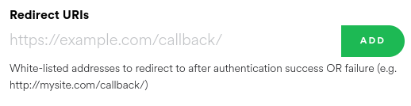

<p align="center">
    
</p>


[](https://github.com/kraxarn/spotify-qt/actions/workflows/linux.yml)
[](https://github.com/kraxarn/spotify-qt/actions/workflows/windows-qt6.yml)
[](https://github.com/kraxarn/spotify-qt/actions/workflows/macos.yml)

An unofficial Spotify client using Qt as a simpler, lighter alternative to the official client,
inspired by [spotify-tui](https://github.com/Rigellute/spotify-tui). Much like spotify-tui, you need
an actual Spotify client running, for example [spotifyd](https://github.com/Spotifyd/spotifyd),
which can be configured from within the app. Also like other clients, controlling music playback
requires Spotify Premium.

#### Contributions are very welcome!

## Goals

* Fast, light on resources, and small file size.
* Portable, and supporting as many platforms and architectures as possible.
* Customizable.

## Non-goals

* Having the same features as the official client.

## Supported platforms

Any system with a C++11 compiler and Qt is supported, but only Linux and Windows are regularly being
tested, so if an issue occurs on your favorite platform, please report it.

## Installing

spotify-qt is available from some package managers. If there are any package issues, or the version
is out of date, contact the respective package maintainers, not me, unless I'm the package
maintainer. If you want to maintain the package on a system not in the list below, you are very much
free to, just please open an issue, or get in contact with me, so I can add it to the list.

| Platform             | Package                                                                                                                                                                                                                                                     | Maintainer                                          |
|----------------------|-------------------------------------------------------------------------------------------------------------------------------------------------------------------------------------------------------------------------------------------------------------|-----------------------------------------------------|
| Arch (or Arch-based) | [](https://aur.archlinux.org/packages/spotify-qt)                                                                                                                          | [kraxarn](https://github.com/kraxarn)               |
| Haiku                | [](https://github.com/haikuports/haikuports/tree/master/media-sound/spotify_qt)                                                                | [Begasus](https://github.com/Begasus)               |
| NetBSD               | [](https://pkgsrc.se/audio/spotify-qt)                                                                                                                    | [pin](https://codeberg.org/pin)                     |
| FreeBSD              | [](https://www.freshports.org/audio/spotify-qt)                                                                                                  | [ehaupt](https://github.com/ehaupt)                 |
| DragonflyBSD         | [](https://github.com/DragonFlyBSD/DPorts/blob/master/audio/spotify-qt/Makefile)                                                                                  | [ehaupt](https://github.com/ehaupt)                 |
| Void Linux           | [](https://github.com/void-linux/void-packages/blob/master/srcpkgs/spotify-qt/template)                                                            | [abenson](https://github.com/abenson)               |
| NixOS                | [](https://github.com/NixOS/nixpkgs/blob/master/pkgs/applications/audio/spotify-qt/default.nix)                                       | [karthikiyengar](https://github.com/karthikiyengar) |
| openSUSE             | [](https://software.opensuse.org//download.html?project=multimedia%3Aapps&package=spotify-qt) | [KaratekHD](https://github.com/KaratekHD)           |
| Other (Linux)        | [](https://snapcraft.io/spotify-qt)                                                                                                                                                                 | [kraxarn](https://github.com/kraxarn)               |

The snap version can be installed by simply running  `snap install spotify-qt`, if that's your
thing. If you want to try out new features, you can download unstable builds automatically built 
every day from [spotify-qt-nightly](https://kraxarn.github.io/spotify-qt-nightly).

## Configuring

* open https://developer.spotify.com/dashboard/
* create a new application
* goto **edit settings** in the app overview
* add `http://localhost:8888` in **Redirect URIs** section

    

* launch Spotify-qt and copy/paste **Client ID** and **Client Secret**, you should be able to login

## Building yourself

Make sure you have Qt (5.9+/6.0+) with SVG support, CMake (3.5+) and various build tools like
`make`, `g++` and `git`. Keep in mind that the master branch is unstable at all times. Therefore,
it's recommended to use the stable branch, which is updated after each new stable release, only
including important bug fixes, unless you want to try out new features.

```
git clone --branch stable https://github.com/kraxarn/spotify-qt.git
cd spotify-qt
mkdir build
cd build
cmake ..
make
./spotify-qt
```
