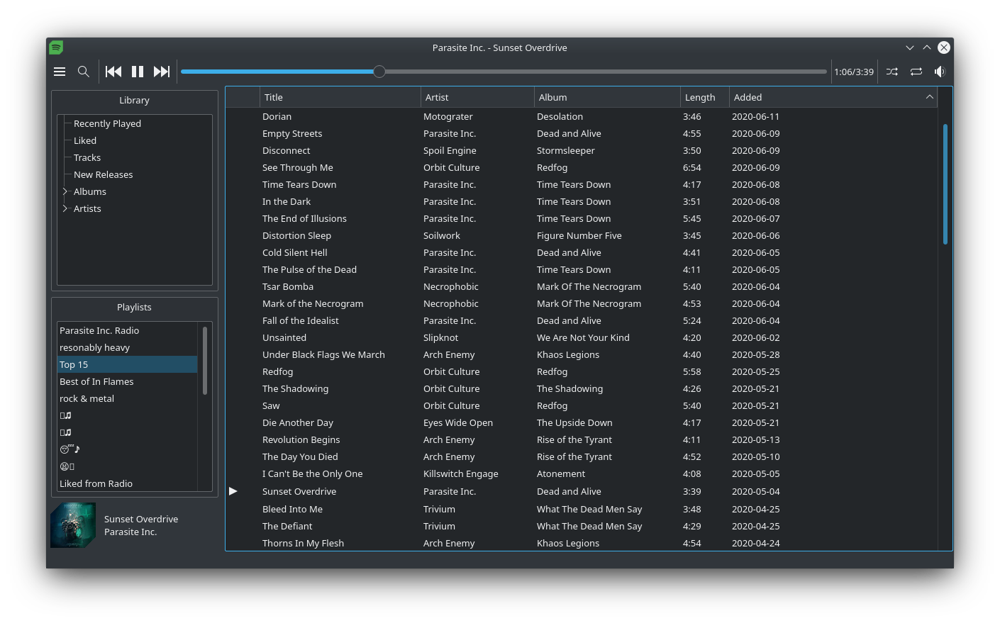

<p align="center">
    
</p>




A Spotify client using Qt as a simpler, lighter alternative to the official client, inspired by [spotify-tui](https://github.com/Rigellute/spotify-tui).
Much like spotify-tui, you need an actual Spotify client running, for example [spotifyd](https://github.com/Spotifyd/spotifyd), which can be configured from within the app. Also like other clients, controlling music playback requires Spotify Premium.

Check out the [spotify-qt-quick](https://github.com/kraxarn/spotify-qt-quick) repo if you're interested in a Qt Quick UI.

#### Contributions are very welcome!

## Supported platforms
Tested: Linux, Windows

Supported: macOS, *BSD, Haiku, any platform [officially supported](https://en.wikipedia.org/wiki/List_of_platforms_supported_by_Qt) by Qt

## Installing
spotify-qt is available from some package managers. If there are any package issues, or the version is out of date, contact the respective package maintainers, not me, unless I'm the package maintainer.
If you want to maintain the package on a system not in the list below, you are very much free to. Just please open an issue, or get in contact with me, so I can add it to the list.

| Platform | Package | Maintainer |
| -------- | ------- | ---------- |
| Arch (or Arch-based) | [](https://aur.archlinux.org/packages/spotify-qt) | [kraxarn](https://github.com/kraxarn) |
| Haiku | [](https://github.com/haikuports/haikuports/tree/master/media-sound/spotify_qt) | [Begasus](https://github.com/Begasus) |
| NetBSD | [](https://pkgsrc.se/audio/spotify-qt) | [voidpin](https://github.com/voidpin) |
| FreeBSD | [](https://www.freshports.org/audio/spotify-qt) | [ehaupt](https://github.com/ehaupt) |

You can also get it as a [snap](https://snapcraft.io/spotify-qt), or just run `snap install spotify-qt`, if that's your thing.

## Building yourself
Make sure you have Qt (5.12+/6.0+), CMake (3.5+) and various build tools like `make`, `g++` and `git`.
Keep in mind that the master branch is considered unstable at all times.
Therefore, it's recommended to use the stable branch, which is updated after each new stable release,
unless you wanted to try out new features.
```
git clone --branch stable https://github.com/kraxarn/spotify-qt.git
cd spotify-qt
mkdir build
cd build
cmake ..
make
./spotify-qt
```